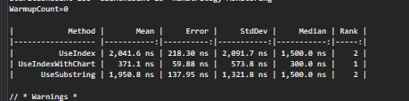
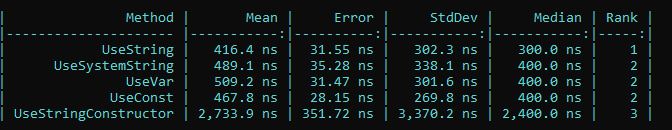
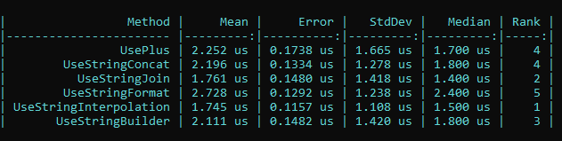
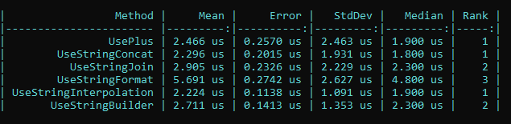

# C#
Here you will found a collection of test in C#

## CompareIndexAndSubstring
A simple test with BenchmarkDotNet

 
   

## CompareStringCreation

just a creation

 
   

## CompareStringConcatenation

 
   

## LongStringCreation

 
   

